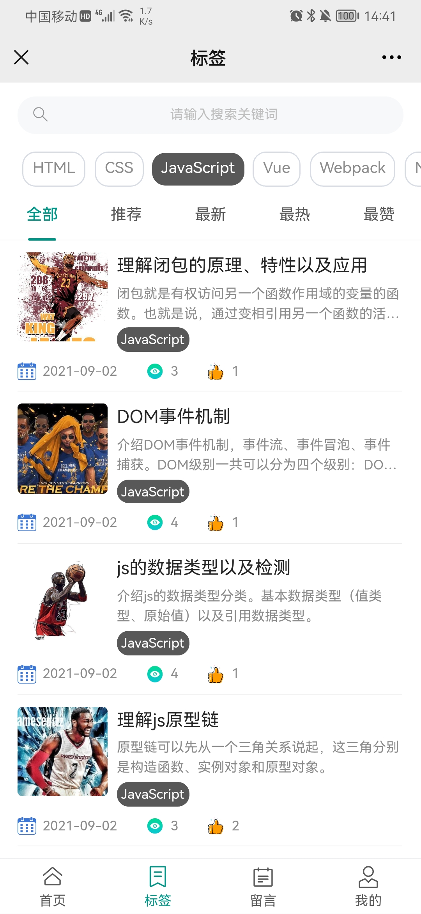
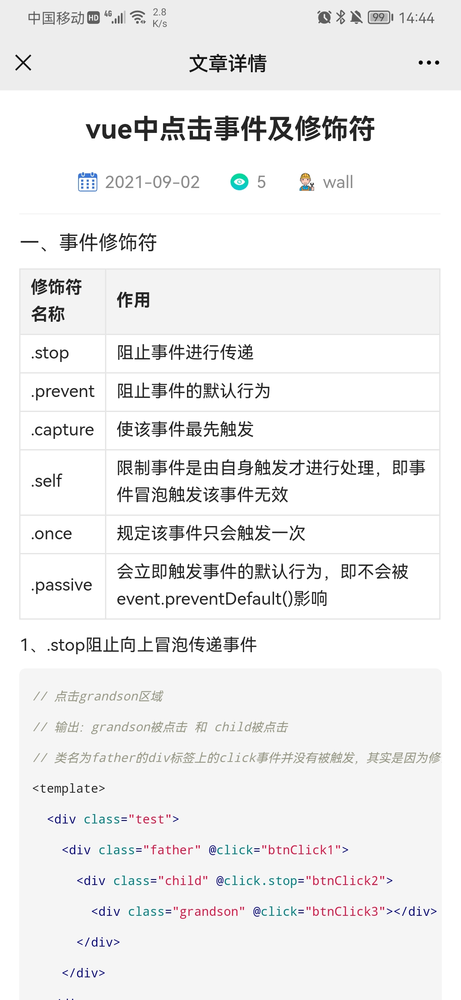
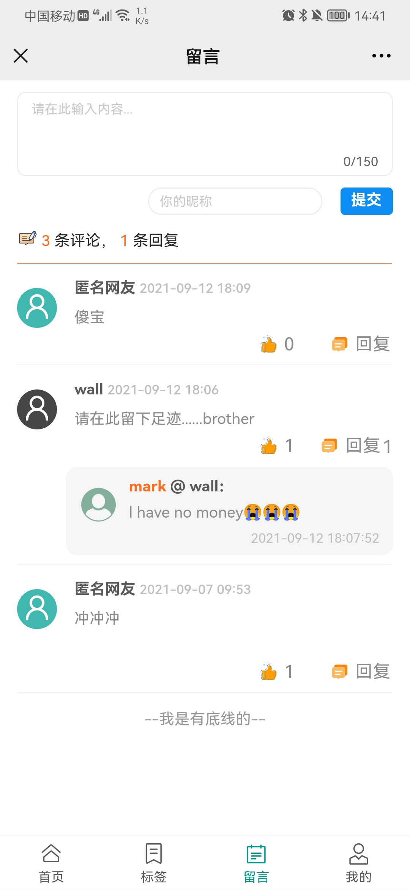

## react-hooks-blog-h5

一款简约的移动端博客。前端项目主要是采用`React17.0`及`Hooks`语法和`Antd-mobile5.0`来搭建的；采用`Webpack4.44`来构建、打包。后端项目主要采用`Node`框架`Koa2`以及`MongoDB`数据库来设计的。

1. PC 版本线上预览地址：[http://www.rasblog.com](http://www.rasblog.com)
2. Vue2 Node PC 版本仓库地址：[https://github.com/Sujb-sus/vue-node-mongodb-blog](https://github.com/Sujb-sus/vue-node-mongodb-blog)
3. Vue3 Vite2 H5 版本仓库地址：[https://github.com/Sujb-sus/vue3-vite2-ts-blog-h5](https://github.com/Sujb-sus/vue3-vite2-ts-blog-h5)

## 项目预览





## 项目结构


## 技术运用

### 一、rem 适配

1. 安装插件`yarn add lib-flexible postcss-px2rem-exclude -S`

- `lib-flexible`是配置可伸缩布局方案，主要是将 1 rem 设为 viewWidth / 10
- `postcss-px2rem-exclude`插件用于将像素（px）单元生成 rem 单位，且可通过配置`exclude`属性忽略 `node_modules`目录下的文件转为 rem 单位

2. 在`src/index.js`导入`lib-flexible`

```js
import 'lib-flexible';
```

3. 在`config/webpack.config.js`配置 postcss-px2rem-exclude

- 引入 postcss-px2rem-exclude
- 找到`getStyleLoaders`函数配置`postcss-loader`的地方
- 在`plugins`配置项里添加`px2rem`的配置内容

```js
const px2rem = require('postcss-px2rem-exclude');

const getStyleLoaders = (cssOptions, preProcessor) => {
   {
      loader: require.resolve('postcss-loader'),
      options: {
         ident: 'postcss',
         plugins: () => [
         postcssNormalize(),
         px2rem({ remUnit: 37.5, exclude: /node_modules/i }),
         ],
      },
   },
}
```

- `remUnit`属性是根据设计稿宽度除以 10 进行设置，假设设计稿为 375，即 remUnit 设为 37.5
- `exclude`属性是忽略`node_modules`目录下的文件转为 rem 单位

### 二、Hooks 运用

#### 1. useState Hook

```jsx
const [state, setState] = useState(initialState);
```

- `useState`传入 state 的初始值`initialState`
- 通过数组解构出 state,`setState`（更新 state 的方法）

#### 2. useEffect Hook

useEffect hook 可以让你在函数组件中执行副作用操作。组件里有两种常见副作用操作：需要清除的和不需要清除的。

其实 useEffect hook 可以看做`class`组件 `componentDidMount`，`componentDidUpdate` 和 `componentWillUnmount` 这三个生命周期函数的组合。

语法：`useEffect(callback, deps)`

##### 无需清除的 effect

发送网络请求，手动变更 DOM，记录日志，这些都是常见的无需清除的操作。

2.1 不传 deps 参数

```jsx
useEffect(async () => {
  await getBlogDetail();
});
```

- 相当于 componentDidMount 和 componentDidUpdate 函数，在组件第一次渲染之后和每次更新之后都会执行 callback

  2.2 deps 传递空数组

```jsx
useEffect(async () => {
  await getBlogDetail();
}, []);
```

- 相当于 componentDidMount 函数，只在组件第一次渲染之后调用一次 callback

  2.3 deps 传递包含 state 值的依赖数组

```jsx
useEffect(() => {
  initData();
}, [pageindex]);
```

- 可以看做 componentDidMount 和 componentDidUpdate 函数的组合，只不过 componentDidUpdate 函数要执行 callback，需要受 deps 控制
- 只有 deps 中的 state 值发生变化，componentDidUpdate 函数才会执行 callback
- 这里类似`vue`中的`watch`，并且开启了立即监听的属性`immediate:true`

##### 需要清除的 effect

有些副作用是需要清除的，防止引起内存泄露。比如订阅外部数据源、设置定时器等

```jsx
let interval = useRef(null);
useEffect(() => {
  interval.current = setInterval(() => {
    //   ...
  }, 200);

  return () => {
    clearInterval(interval.current);
  };
}, []);
```

- useEffect 在执行 callback 时，如果 callback 返回一个函数，那么这个函数就相当于 componentWillUnmount 函数，在里面可以处理要清除 effect 的逻辑

#### 3. useRef、useImperativeHandle Hook

3.1 在 DOM 节点上定义`ref`属性，通过`.current`就可以获取到该 DOM 元素

```jsx
let inputEl = useRef(null);
const handleFocus = () => {
  inputEl.current.focus();
};
return (
  <>
    <input ref={inputEl} type="text" />
    <button onClick={handleFocus}>Focus the input</button>
  </>
);
```

3.2 子组件结合`forwardRef`方法和 useImperativeHandle hook 可自定义暴露方法给父组件

```jsx
// 子组件
const CommentEditor = forwardRef((props, ref) => {
   let { submitSuccess } = props;
   // 暴露方法给父组件
   useImperativeHandle(ref, () => ({
    resetData,
   }));
   // 重置表单数据
   const resetData = () => {
      console.log('resetData');
   };
   const handleSubmit = () => {
    submitSuccess();
  };
  <button onClick={handleSubmit}>提交</button>
}
```

```jsx
// 父组件
const Message = () => {
  let editorRef = useRef();
  const addMessage = () => {
    // 获取子组件的resetData方法
    editorRef.current.resetData();
  };
  return <CommentEditor submitSuccess={addMessage} ref={editorRef} />;
};
```

- 通过`forwardRef`方法包裹子组件，子组件可接收父组件的`ref`属性
- 在子组件定义 useImperativeHandle Hook，自定义方法`resetData`，暴露给父组件
- 在父组件定义 useRef Hook，通过 `ref` 属性传给子组件，便可接收子组件暴露的数据

#### 4. useMemo Hook

useMemo 用于性能优化，通过记忆值来避免在每个渲染上执⾏高开销的计算。

语法：useMemo(callback, deps)

- 不传 deps 参数，每次更新都会重新计算
- deps 为空数组，只会计算一次
- deps 为 state 组成的依赖数组，当对应的 state 发生变化时，才会重新计算(可以依赖另外一个 useMemo 返回的值)

```jsx
const isInclude = useMemo(
  () => isLikeSuccess && likeList.includes(id),
  [likeList, isLikeSuccess]
);
// 返回一个布尔值，可直接使用
isInclude;
```

#### 5. useCallback Hook

useCallback 可以说是 useMemo 的语法糖；它的使用和 useMemo 是一样的，只是 useCallback 返回的是一个函数。

`useCallback(fn, deps)`相当于`useMemo(() => fn, deps)`，也就是说 useMemo 的 callback 返回了一个函数。

```jsx
const getLikesColor = useCallback(
  (id) => isLikeSuccess && likeList.includes(id),
  [likeList, isLikeSuccess]
);
// 返回一个参数，调用时传入id参数
getLikesColor(commentItem._id);
```

- useMemo、useCallback 功能跟`vue`中的`computed`类似，`computed`中会自动监听所有依赖值，只要其中一个依赖值的数据发生变化，便会重新计算更新数据
- useMemo、useCallback 则是自定义传入依赖，只有传入的依赖数据发生变化，才会重新计算更新数据，比较灵活

#### 6. 自定义 Hook

```jsx
// useHooks/useGetLabelColor
import { useCallback } from 'react';
import { useSelector } from 'react-redux';
/**
 * 封装获取标签背景色逻辑
 * @description 文章Item、文章详情Detail
 */
const useGetLabelColor = () => {
  let labelList = useSelector((state) => state.label);

  // 获取标签颜色
  const getLabelColor = useCallback(
    (labelName) => {
      if (labelList.length) {
        let labelIndex = 0;
        labelList.forEach((item, index) => {
          if (labelName === item.label) {
            labelIndex = index;
          }
        });
        return labelList[labelIndex].bgColor;
      }
      return '';
    },
    [labelList]
  );

  return {
    getLabelColor,
  };
};
export default useGetLabelColor;
```

```jsx
// 在组件里导入，解构，运用
import useGetLabelColor from '@/useHooks/useGetLabelColor';
const Article = () => {
  let { getLabelColor } = useGetLabelColor();
  return (
    <div
      className="box-text label-text"
      style={{ backgroundColor: getLabelColor(label) }}
    </div>
  );
};
```

### 三、组件通信

#### 1. 父组件传值给子组件

```jsx
// 父组件
<List hideTitle={true} params={params}></List>
```

```js
// 子组件
const List = (props) => {
  // ...
};
```

- 父组件通过属性传值给子组件
- 子组件通过`props`接收父组件的数据

#### 2. 子组件传值给父组件

```jsx
// 父组件
let [params, setParams] = useState({ type: '' });
<LabelSelect params={params} setParams={setParams} />;
```

```js
// 子组件
const LabelSelect = (props) => {
  let { params, setParams } = props;

  const handleLabel = () => {
    params.type = 'js';
    setParams({ ...params });
  };
};
```

- 父组件定义好要传给子组件的方法`setParams`，通过 props 传给子组件
- 子组件接收 props，解构出 setParams 方法
- 通过在子组件中调用该方法，并传入参数`{ ...params }`
- 父组件就能接收子组件传入的参数，更新父组件的`params`数据

### 四、react-router v6 新特性

1. `<Switch>`重命名为`<Routes>`，功能保持不变
2. `<Route>`的新特性变更，`component/render`属性被`element`属性替代
3. 新 hook `useRoutes`代替``react-router-config`
4. 用`useNavigate`代替`useHistory`，将`history.push()`替换为`navigation()`
5. 新 api：`<Outlet/>`，类似`vue`中`<router-view><router-view/>`
6. [更多具体用法可参考官方文档](https://reactrouter.com/docs/en/v6/api)

```jsx
// tabbar/index.jsx
import { useNavigate, useLocation } from 'react-router-dom';
import { TabBar } from 'antd-mobile';
import { Outlet } from 'react-router-dom';

const FixedBottomNavigation = () => {
  let navigate = useNavigate();
  let location = useLocation();
  let { pathname } = location;

  // 路由跳转
  const setRouteActive = (path) => {
    navigate(path);
  };
  return (
    <>
      {/* 匹配TabBar组件的子路由 */}
      <Outlet />

      <TabBar
        className="tabbar-footer btm-btn-bar-ipx"
        activeKey={pathname}
        onChange={(value) => {
          setRouteActive(value);
        }}>
        {tabs.map((item) => (
          <TabBar.Item key={item.path} icon={item.icon} title={item.title} />
        ))}
      </TabBar>
    </>
  );
};
export default FixedBottomNavigation;
```

```jsx
// router/index.jsx
import { lazy, Suspense } from 'react';
import { Loading } from 'antd-mobile';
import { useRoutes } from 'react-router-dom';
import Tabbar from '@/components/tabbar';

const Home = lazy(() => import('@/pages/home'));
const Label = lazy(() => import('@/pages/label'));
const Article = lazy(() => import('@/pages/article'));
// 路由懒加载，需配合Suspense使用
const lazyLoad = (children) => {
  return <Suspense fallback={<Loading />}>{children}</Suspense>;
};
const AppRouter = () => {
  return useRoutes([
    {
      path: '/',
      element: <Tabbar />,
      children: [
        {
          path: 'home',
          element: lazyLoad(<Home />),
        },
        {
          path: 'label',
          element: lazyLoad(<Label />),
        },
      ],
    },
    { path: '/article/detail/:id', element: lazyLoad(<Article />) },
  ]);
};
export default AppRouter;
```

### 四、react-redux 使用

```jsx
// redux/store,js
import { createStore, applyMiddleware } from 'redux';
import reducer from './reducers';
import thunk from 'redux-thunk';
import { composeWithDevTools } from 'redux-devtools-extension';

export default createStore(
  reducer,
  composeWithDevTools(applyMiddleware(thunk))
);
```

- 配置 `composeWithDevTools` 是为了能在 `redux devtools` 插件中查看存储在 redux 数据的状态变化
- 要在 redux 进行异步请求，需要安装 `redux-thunk `依赖库，配合 `applyMiddleware` 中间件使用

```jsx
// redux/reducers/index.js
import { combineReducers } from 'redux';
import label from './label';

export default combineReducers({
  label,
});
```

- `combineReducers`是用来合并多个`reducer`，并统一暴露出去

自定义一个获取标签数据的 hook，组件中需要引用标签数据的，将其引入；组件更新时会先从 redux 拿数据，无数据的话就重新发起异步请求，此举是为了防止页面刷新，redux 里的数据丢失。

```jsx
// useHooks/useGetLabelList.js
import { useEffect } from 'react';
import { getLabelList } from '@/redux/actions/label';
import { useSelector, useDispatch } from 'react-redux';

const useGetLabelList = () => {
  let labelList = useSelector((state) => state.label);
  let dispatch = useDispatch();

  // 获取标签数据，存储到redux
  useEffect(() => {
    if (!labelList.length) {
      dispatch(getLabelList());
    }
  }, []);
};
export default useGetLabelList;
```

- `useSelector`获取存储在 redux 的数据
- 要在 redux 进行异步请求，就需要通过`useDispatch`来分发`actions`

### 五、配置代理

`http-proxy-middleware`是一个代理中间件，通过它把请求代理转发到其他服务器，解决跨域问题

1. 安装`yarn add http-proxy-middleware`
2. 在 src 中新建 `setupProxy.js`文件，并配置

```js
// src/setupProxy.js
const { createProxyMiddleware } = require('http-proxy-middleware');

module.exports = (app) => {
  app.use(
    createProxyMiddleware('/client_api', {
      target: 'http://localhost:3000/client_api/', // 设置目标服务器host
      secure: false,
      changeOrigin: true, // 是否需要改变原始主机头为目标URL
      pathRewrite: {
        '^/client_api': '/', // 重写目标url路径，将client_api前缀去掉
      },
    })
  );
};
```

### 六、其他

#### 1. React.memo

```jsx
import React from 'react';

const SvgIcon = (prop) => {
  let iconName = `#${prop.name}`;
  return (
    <svg className="icon" aria-hidden="true">
      <use xlinkHref={iconName}></use>
    </svg>
  );
};
export default React.memo(SvgIcon);
```

- React.memo 为高阶组件
- React.memo 仅检查 props 变更
- 组件在相同 props 的情况下渲染相同的结果，就可以将其包装在 React.memo 中调用，组件就会直接复用最近一次渲染的结果，而不会重新渲染

#### 2. React.Fragment

组件在返回多个元素时，需要有一个根节点包裹着，这样有时候会给 DOM 中增加额外节点

Fragments 可以让你聚合一个子元素列表，并且不在 DOM 中增加额外节点。

短语法是`<> </>`像空标签，但是短语法不支持绑定`key`属性以及其他属性

```jsx
// 带 key 的 Fragments
return (
  <dl>
    {props.items.map((item) => (
      <React.Fragment key={item.id}>
        <dt>{item.term}</dt>
        <dd>{item.description}</dd>
      </React.Fragment>
    ))}
  </dl>
);
```

```jsx
// 短语法
return (
  <>
    <Outlet />
    <TabBar />
  </>
);
```

## 后端服务

必须得先开启后端服务接口，连接上`MongoDB`数据库，不然前端项目没法预览。这边的服务接口其实是复用了 PC 端`wall-blog`项目的接口。所以如果想要在管理后台添加数据的，需要移至该仓库：[https://github.com/Sujb-sus/vue-node-mongodb-blog](https://github.com/Sujb-sus/vue-node-mongodb-blog)。

该仓库下共有三个项目，PC 管理端（admin）、PC 客户端（client）、后台服务端（server）。`server`项目其实就是本项目的`server`目录，为了方便大家的预览，我 Copy 了一份过来。

- client：博客的 PC 端
- admin：博客的管理端，就是用来添加文章数据、标签数据等等
- server：给博客提供接口服务数据

### 开启后端接口服务

#### 方式一、移至上述所说的仓库地址

该仓库下有详细的描述，主要流程如下：

1. 查看注意事项，先安装、连接好本地的`MongoDB`数据库，开启服务
2. 启动`admin`项目，就可以通过管理后台手动添加数据了

#### 方式二、直接在本项目连接`MongoDB`数据库

1. 项目启动前，需要在本地安装好`MongoDB`数据库；

2. 在`server/config.js`文件配置数据库名、用户以及密码等一些必要的信息；这些信息都可以自定义，但是需要跟`步骤3`同步起来；

```js
// server/config.js
export default {
  env: process.env.NODE_ENV,
  port,
  auth,
  log,
  mongodb: {
    username: 'wall', // 数据库用户
    pwd: 123456, // 数据库密码
    address: 'localhost:27017',
    db: 'wallBlog', // 数据库名
  },
};
```

3. 启动本地的`mongo`服务，给数据库初始化在`server/config.js`配置的一些必要信息；

```js
> mongo // 开启mongo服务
> show dbs // 显示数据库列表
> use wallBlog // 新建一个wallBlog数据库
> db.createUser({user:"wall",pwd:"123456",roles:[{role:"readWrite",db:'wallBlog'}]}) // 在wallBlog数据库创建一个wall用户，密码为123456
> show users // 展示该库有哪些用户
> db.auth("wall", "123456"); // 数据库认证一下用户、密码，返回 1 认证成功
```

4. 进入`server`目录，安装依赖，并开启服务

```js
cd server // 进入server目录
yarn // 安装依赖包
yarn server // 开启后端接口，成功了便会提示数据库连接成功
```

## 注意事项
